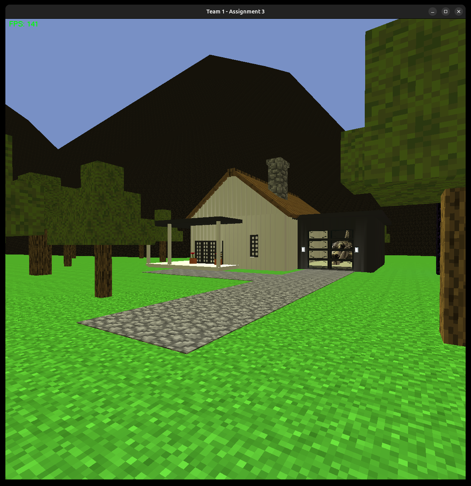
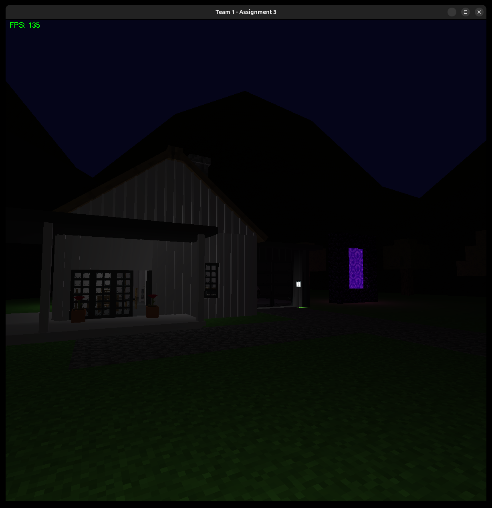
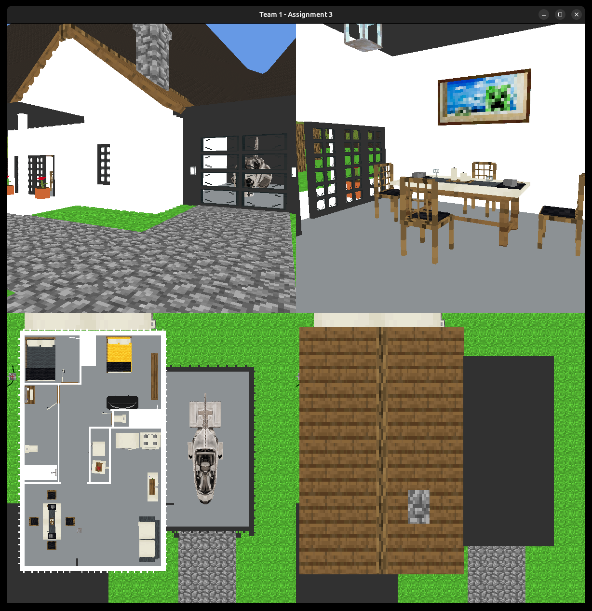
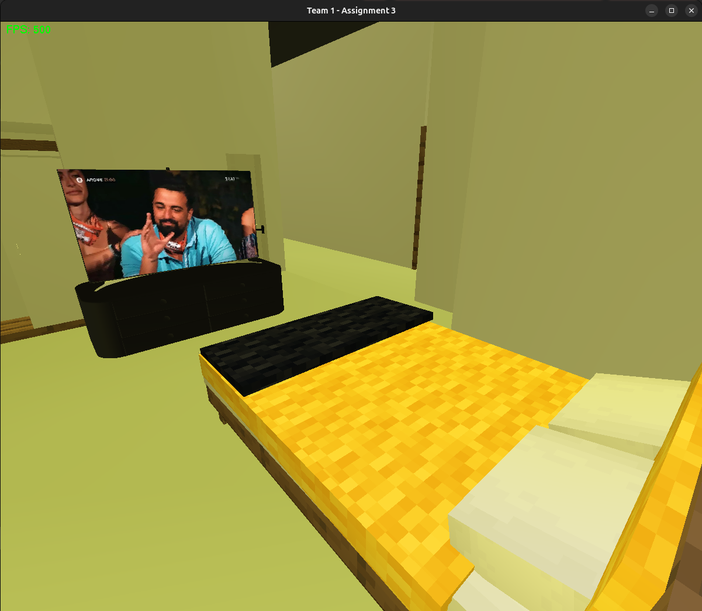
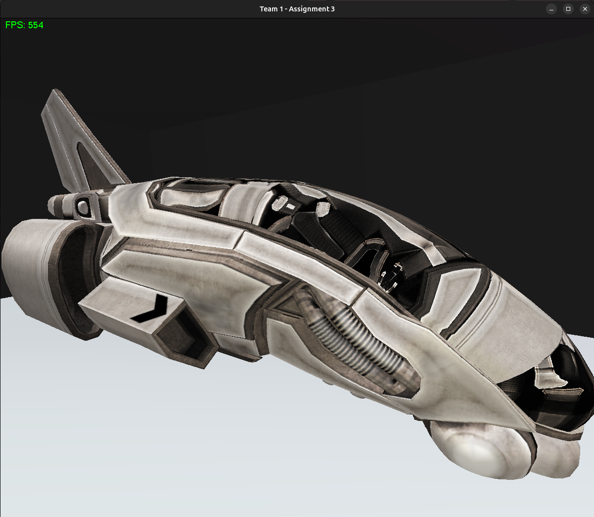
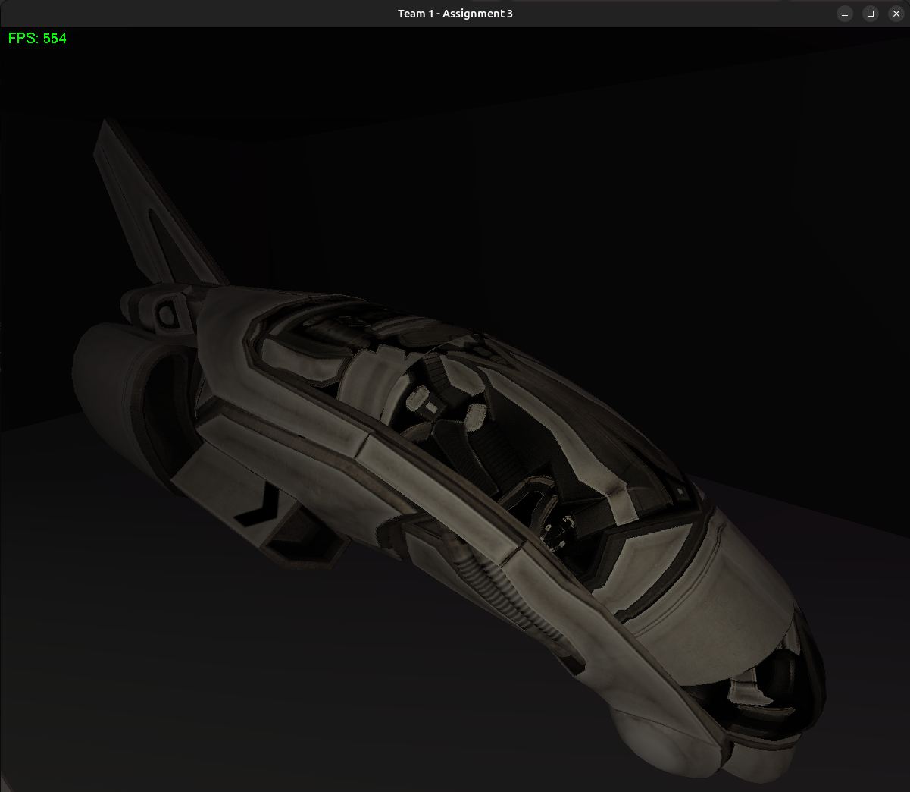

# ECE433 Computer Graphics


Coursework for **ECE433 — Computer Graphics with OpenGL** at the **University of Thessaly**. The repository covers raster graphics, antialiasing, scanline polygon filling, clipping, 2D/3D transformations, lighting, texturing, culling, and a substantially extended final 3D scene project.

The main portfolio piece is **Homework 3 / Project 3: Visiting a 3D House**: a first-person OpenGL scene that grew beyond the assignment into a small modular rendering/game framework with hierarchical objects, hot-reloadable assets, dynamic lighting, textured models, transparent windows, a day/night cycle, NURBS terrain features, and multiple camera/view modes.

## Quick overview

| Area | What is included |
| --- | --- |
| Rasterization | Bresenham-style lines, Xiaolin Wu-style antialiasing, circles, filled circles, interactive drawing tools. |
| Polygon algorithms | Scanline polygon filling, RGB interpolation, Sutherland-Hodgman clipping, interactive polygon/clipping demos. |
| Transformations | Written 2D/3D homogeneous-coordinate transformation exercises and worked examples. |
| OpenGL scene work | Lighting, materials, texture mapping, culling, camera navigation, multi-viewport rendering. |
| Final project | A furnished, explorable 3D house and outdoor environment with a custom scene/object framework. |

## Standout project: interactive 3D house

<p align="center">
  
  
</p>

<p align="center">
  
  
</p>

<p align="center">
  
  
</p>

The assignment asked for a 3D house or 3D space with transformations, modeling, hidden-surface removal, lighting, texture mapping, a moving camera, and a separate view-rendering program. This implementation goes much further:

- **Hierarchical object system:** `Object` supports parent/child composition, recursive transforms, polymorphic drawing through `drawInternal()`, and grouped scene objects such as rooms, furniture, lanterns, framed windows, and the full house.
- **Display-list optimization:** static objects can be compiled into OpenGL display lists, avoiding repeated expensive redraw setup for heavy geometry.
- **Transparency pipeline:** transparent objects are tracked separately and sorted relative to the camera before rendering, used for glass/window rendering and masked textures.
- **Manager-based architecture:** separate managers coordinate game state, window setup, input, lighting, materials, textures, assets, and global scene lifecycle.
- **First-person camera:** WASD movement, mouse-look or keyboard-look modes, optional flight mode, frame-rate-independent motion via delta time, fullscreen toggling, and an attachable flashlight.
- **Dynamic lighting:** global ambient light, multiple local lights, a camera-following flashlight, lantern/portal lighting, and a time-varying sun/moon system.
- **Day/night environment:** sun and moon objects orbit the scene while the sky color and light color update over time.
- **Textured house and environment:** floors, walls, posters, grass, stone, glass, Minecraft-style blocks, and imported/converted texture assets.
- **Hot-reloadable assets:** many pieces of furniture and scene objects are described in text files and loaded through a custom `AssetLoader`, so placement can be edited without recompiling.
- **OBJ model support:** `Model` loads external `.obj` geometry, including the detailed car model used in the garage scene.
- **Procedural/NURBS geometry:** a reusable `SplineObject` / `NurbsCurve` / `NurbsSurface` layer wraps GLU NURBS. It is used for the mountainous horizon and curved objects such as the garden hose.
- **Two executable views:** `visiting3Dhouse` provides the navigable first-person experience, while `views` presents orthographic/perspective floor-plan, roof, exterior, and rotating interior views.

## Repository contents

| Path | Description |
| --- | --- |
| [`homework-1-rasterization-antialiasing/`](homework-1-rasterization-antialiasing/) | Rasterization exercises: line drawing, antialiasing, circles, filled circles, OpenGL examples, pseudocode, the project handout, and antialiasing notes. |
| [`homework-2-polygon-fill-clipping/`](homework-2-polygon-fill-clipping/) | Polygon filling, color interpolation, 2D/3D transformation theory, Sutherland-Hodgman clipping, an interactive gradient polygon filler, and an interactive polygon clipping tool. |
| [`homework-3-3d-house/`](homework-3-3d-house/) | Lighting/texturing/culling lecture examples plus the final 3D house simulation in [`final-3d-house/`](homework-3-3d-house/final-3d-house/). |
| [`docs/images/`](docs/images/) | Selected final-project screenshots used by this README. |

## Homework details

### Homework 1 — Rasterization and antialiasing

Homework 1 starts with lower-level raster graphics algorithms before moving to interactive OpenGL programs.

Implemented/reported work includes:

- Bresenham-style line drawing.
- Xiaolin Wu-style antialiased line drawing.
- Circle and filled-circle rasterization.
- Object storage for interactive drawing.
- Mouse-driven point/line/circle creation.
- Keyboard-controlled drawing color and mode selection.

Useful paths:

- [`homework-1-rasterization-antialiasing/handout-project-1.pdf`](homework-1-rasterization-antialiasing/handout-project-1.pdf)
- [`homework-1-rasterization-antialiasing/antialiasing-notes.pdf`](homework-1-rasterization-antialiasing/antialiasing-notes.pdf)
- [`homework-1-rasterization-antialiasing/exercise-4-antialiased-lines/`](homework-1-rasterization-antialiasing/exercise-4-antialiased-lines/)
- [`homework-1-rasterization-antialiasing/exercise-5-circle-drawing/`](homework-1-rasterization-antialiasing/exercise-5-circle-drawing/)

### Homework 2 — Polygon filling, transformations, and clipping

Homework 2 combines written transformation/clipping exercises with two interactive OpenGL implementations.

Implemented/reported work includes:

- Scanline polygon filling using an active-edge table/list.
- RGB color interpolation along polygon edges and across scanlines.
- Sutherland-Hodgman polygon clipping pseudocode and worked examples.
- Interactive polygon input with per-vertex colors.
- Interactive clipping-window selection and polygon clipping.
- Optional fill toggling for clipped polygons.

Useful paths:

- [`homework-2-polygon-fill-clipping/handout-project-2.pdf`](homework-2-polygon-fill-clipping/handout-project-2.pdf)
- [`homework-2-polygon-fill-clipping/report-project-2.pdf`](homework-2-polygon-fill-clipping/report-project-2.pdf)
- [`homework-2-polygon-fill-clipping/exercise-11-gradient-polygon-fill/`](homework-2-polygon-fill-clipping/exercise-11-gradient-polygon-fill/)
- [`homework-2-polygon-fill-clipping/exercise-12-interactive-polygon-clipping/`](homework-2-polygon-fill-clipping/exercise-12-interactive-polygon-clipping/)

### Homework 3 — Visiting a 3D house

Homework 3 is the final project and the deepest implementation in the repository. It contains lecture/lab examples for lighting, texturing, culling, and camera movement, then the full 3D house simulation.

Useful paths:

- [`homework-3-3d-house/handout-project-3.pdf`](homework-3-3d-house/handout-project-3.pdf)
- [`homework-3-3d-house/final-3d-house/report-project-3.pdf`](homework-3-3d-house/final-3d-house/report-project-3.pdf)
- [`homework-3-3d-house/final-3d-house/src/`](homework-3-3d-house/final-3d-house/src/)
- [`homework-3-3d-house/final-3d-house/assets/`](homework-3-3d-house/final-3d-house/assets/)
- [`homework-3-3d-house/final-3d-house/textures/`](homework-3-3d-house/final-3d-house/textures/)

## Build and run

The final project is a C++/OpenGL/GLUT project. A normal Linux OpenGL/X11 development toolchain is recommended.

On Debian/Ubuntu-like systems:

```bash
sudo apt install build-essential freeglut3-dev libglew-dev libgl1-mesa-dev libglu1-mesa-dev libx11-dev
```

Build the final project:

```bash
cd homework-3-3d-house/final-3d-house/src
make clean
make all -j"$(nproc)"
```

Run the first-person simulation from the final-project root so asset paths resolve correctly:

```bash
cd ..
target/linux/visiting3Dhouse .
```

Run the multi-view renderer:

```bash
target/linux/views .
```

If mouse warping is blocked by your window manager, build with keyboard-only camera rotation:

```bash
cd homework-3-3d-house/final-3d-house/src
make clean
make all -j"$(nproc)" USE_MOUSE=0
```

## Controls for `visiting3Dhouse`

| Action | Mouse-look mode | Keyboard-look mode |
| --- | --- | --- |
| Move | `W`, `A`, `S`, `D` | `W`, `A`, `S`, `D` |
| Fly up / down | `Space` / `Z` | `Space` / `Z` |
| Look around | Mouse movement | `I`, `J`, `K`, `L` |
| Toggle flight mode | `F` | `F` |
| Toggle flashlight | `E` | `E` |
| Reload text assets | `R` | `R` |
| Toggle fullscreen | `F11` | `F11` |
| Quit | `ESC` or `Q` | `ESC` or `Q` |
